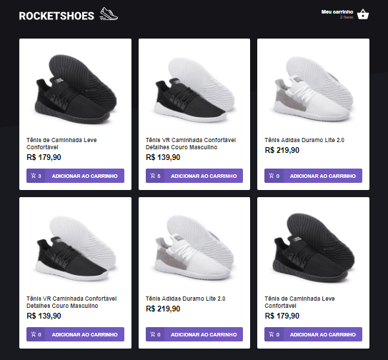
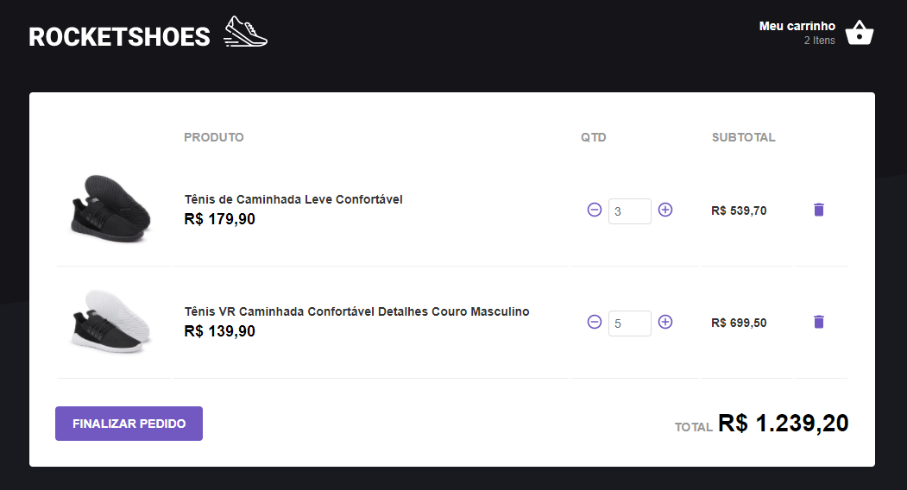

<h1 align="center">
    
</h1>

 

## 🚀 Tecnologias

Esse projeto foi desenvolvido com as seguintes tecnologias:

- [React + Redux + Redux Saga]

## 💻 Projeto

O projeto demonstra um e-commerce que vende sapatos e tem a principal intenção de exemplificar a funcionalidade de um carrinho de compras. Este projeto foi feito apenas para estudos e foi concebido através de um curso provido pela empresa Rocketseat

 

Os dados dessa aplicação foram consumidos de uma API feita através do JSON Server com dados apenas para demonstração. 

 

## ⚙ Funcionalidades:

- Permite que o usuário selecione os sapatos que deseja comprar, consultando o estoque em tempo real para verificar se há o item disponível.
- Se o item não estiver disponível, uma mensagem é exbida na tela através da biblioteca React Toastify.
- Ao clicar em "Meu Carrinho" o usuário é direcionado para a tela com os produtos selecionados. Nela, são calculados os valores subtotal e total.
- Permite que o usuário manipule a quantidade dos produtos na tela "Meu Carrinho", também consultando o estoque.
- Cada vez que a quantidade de produtos é alterada, os valores total e subtotal são recalculados em tempo real.

## Telas da Aplicação: 

### Tela Home:

 

 

### Tela do Carrinho:

 

